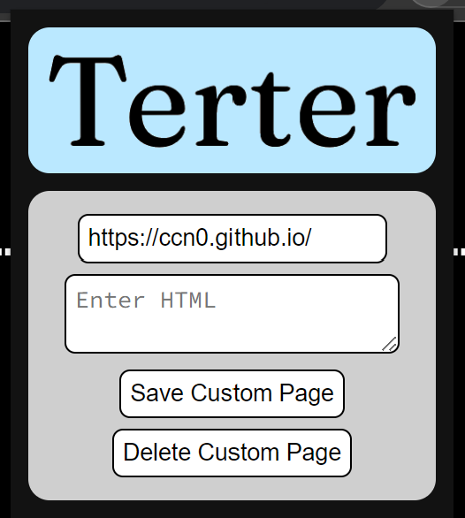

# Terter

Change the HTML that loads when you visit a URL.

## Install

### Chrome/Edge/Chromium

- Go to `chrome://extensions`, and turn on Developer Mode.
- Unpack the terter.zip, then click Load Unpacked
- Select the unpack `terter\` directory

### Firefox

- [Install it from Firefox Addons](https://addons.mozilla.org/en-US/firefox/addon/terter/)

#### Manually

- Download the .xpi file from Releases
- Open `about:addons`
- Click the gear and select Load Addon from File
- Open the .xpi file

## Usage

- Click on the extension in the extensions bar.

- You will see a text box for the URL (autofills with the current page's URL), a text box for the HTML of your custom page, and a submit and delete button.

- To create a custom page, type in your URL, type in your custom HTML, and click Save Custom Page.

- To delete a custom page, type in the URL of the custom page, and click delete. You do not need to type in any HTML.
